# UML Diagrams - SumbiTheses System

System pro odevzdávání, hodnocení a zveřejňování maturitních projektů

---

## Table of Contents
1. [User Role Hierarchy](#1-user-role-hierarchy)
2. [Use Case Diagrams](#2-use-case-diagrams)
3. [Class Diagram](#3-class-diagram)
4. [Sequence Diagrams](#4-sequence-diagrams)
5. [Activity Diagram](#5-activity-diagram)
6. [ER Diagram](#6-er-diagram)

---

## 1. User Role Hierarchy

### School-Level User Roles

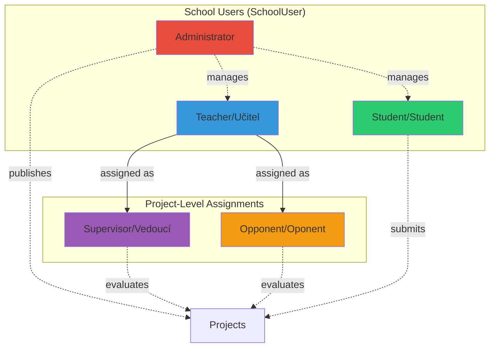

### Role Descriptions

| Role | Czech | Description | Permissions |
|------|-------|-------------|-------------|
| **Student** | Student | Studenti školy | Submit projects, view own projects, view assigned reviews |
| **Teacher** | Učitel | Učitelé/pedagogové školy | Can be assigned as Supervisor or Opponent, write reviews, evaluate projects |
| **Administrator** | Administrátor | Správce školy | Manage users, schools, projects, publish approved projects |
| **Supervisor** | Vedoucí | Učitel přiřazený jako vedoucí projektu | Evaluate project, provide feedback, approve/reject |
| **Opponent** | Oponent | Učitel přiřazený jako oponent projektu | Review project, provide critique, grade |

---

## 2. Use Case Diagrams

### 2.1 Student Use Cases

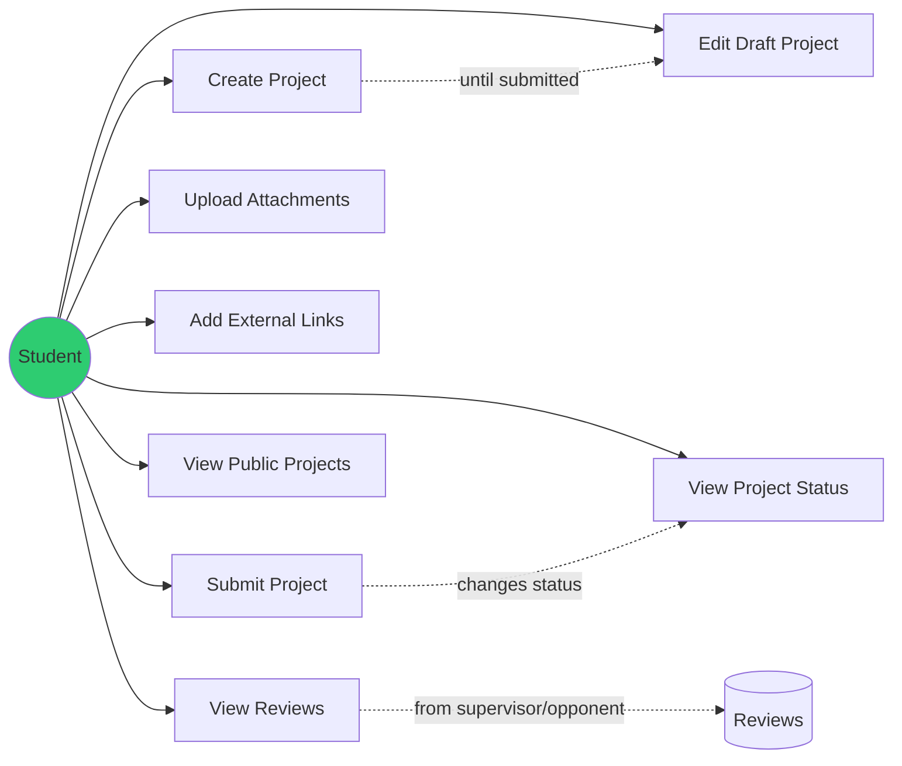

### 2.2 Teacher Use Cases (as Supervisor)

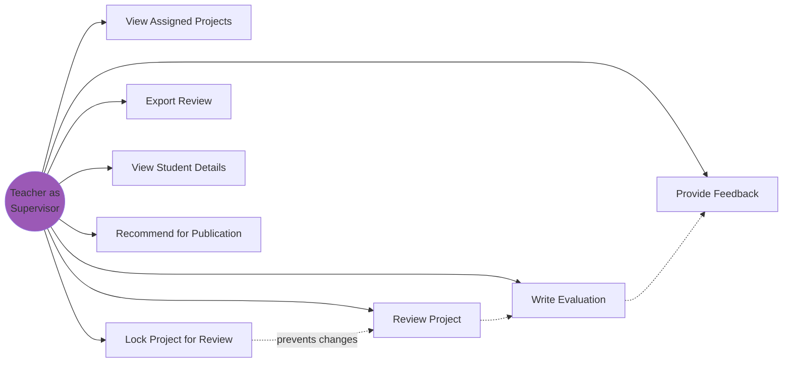

### 2.3 Teacher Use Cases (as Opponent)

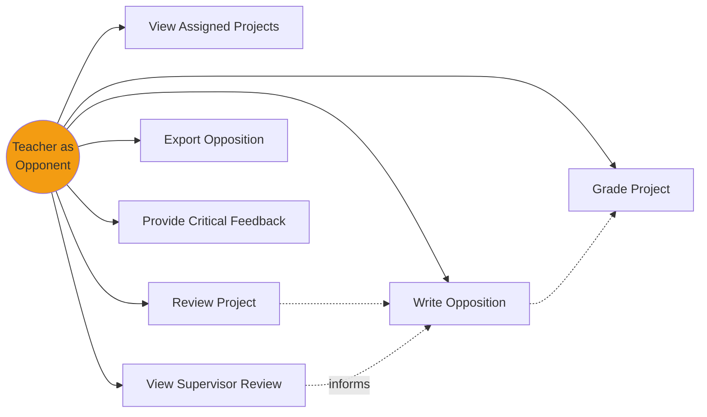

### 2.4 Administrator Use Cases

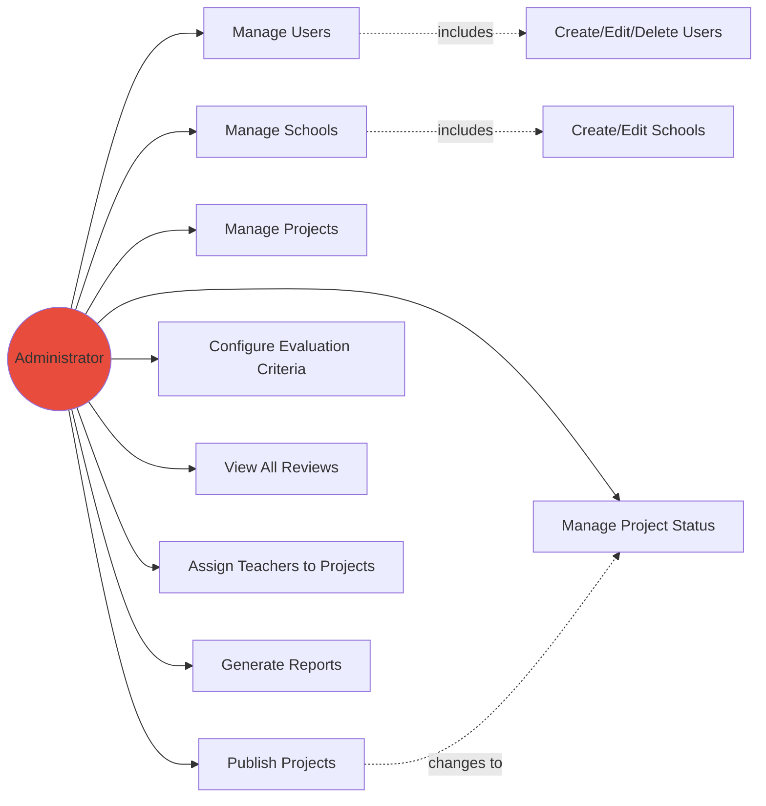

### 2.5 Complete System Use Case Diagram

```mermaid
graph TB
    Student((Student))
    Teacher((Teacher))
    Admin((Administrator))
    Public((Public<br/>Visitor))

    subgraph "Project Management"
        UC1[Create/Edit Project]
        UC2[Submit Project]
        UC3[Upload Files]
        UC4[Add Links]
    end

    subgraph "Evaluation"
        UC5[Review Project]
        UC6[Write Evaluation]
        UC7[Grade Project]
        UC8[Lock Project]
    end

    subgraph "Administration"
        UC9[Manage Users]
        UC10[Manage Schools]
        UC11[Publish Projects]
        UC12[Configure Criteria]
    end

    subgraph "Public Access"
        UC13[Browse Projects]
        UC14[Search Projects]
        UC15[View Project Details]
    end

    Student --> UC1
    Student --> UC2
    Student --> UC3
    Student --> UC4
    Student --> UC13
    Student --> UC14

    Teacher --> UC5
    Teacher --> UC6
    Teacher --> UC7
    Teacher --> UC8

    Admin --> UC9
    Admin --> UC10
    Admin --> UC11
    Admin --> UC12
    Admin --> UC5

    Public --> UC13
    Public --> UC14
    Public --> UC15

    style Student fill:#2ecc71
    style Teacher fill:#3498db
    style Admin fill:#e74c3c
    style Public fill:#95a5a6
```

---

## 3. Class Diagram

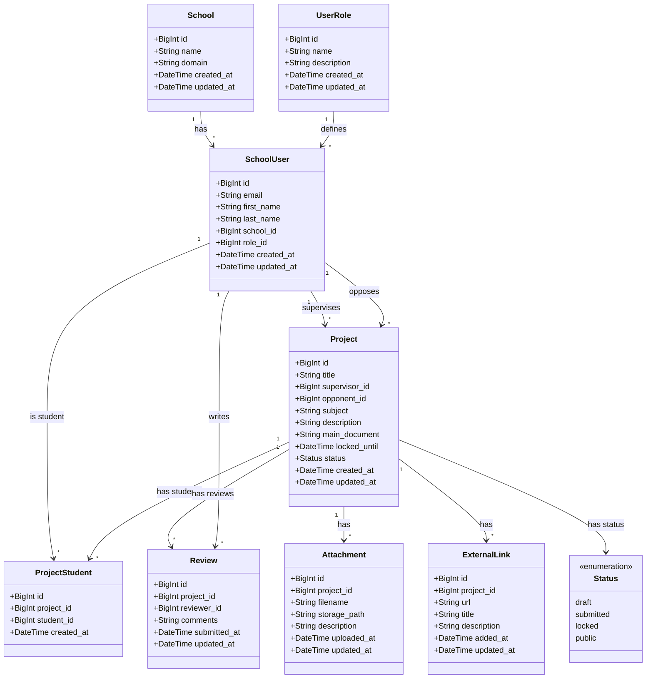

---

## 4. Sequence Diagrams

### 4.1 Student: Submit Project Workflow

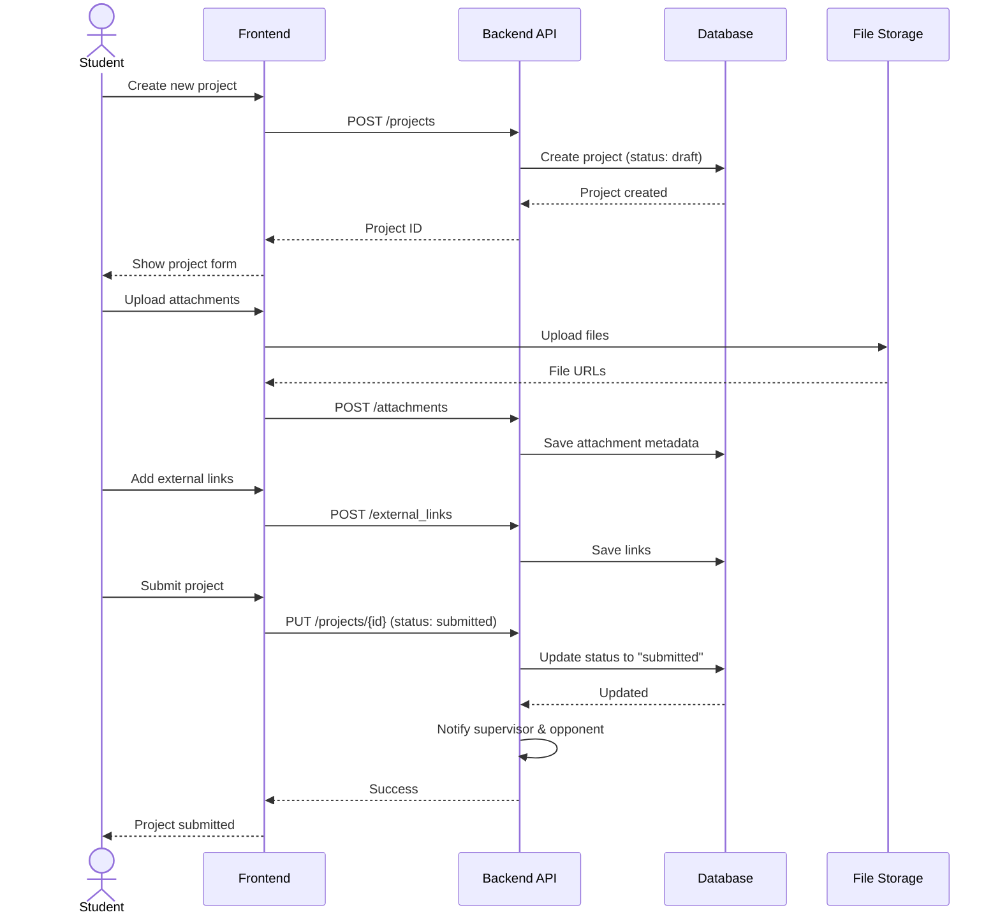

### 4.2 Teacher as Supervisor: Evaluate Project

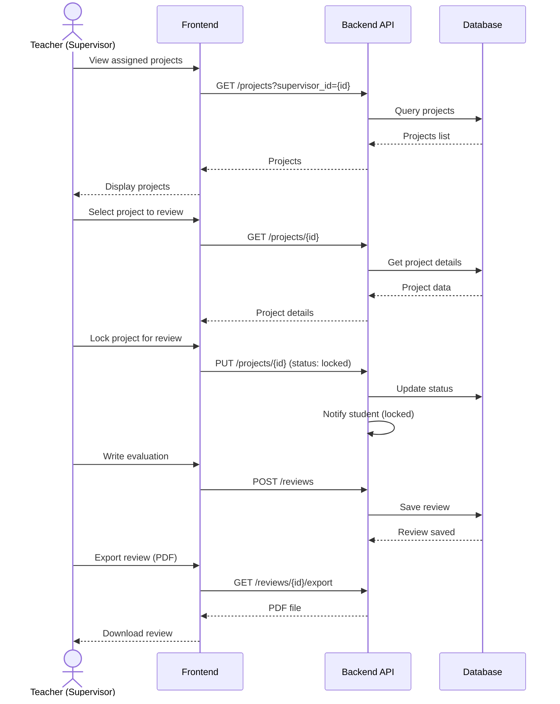

### 4.3 Teacher as Opponent: Review Project

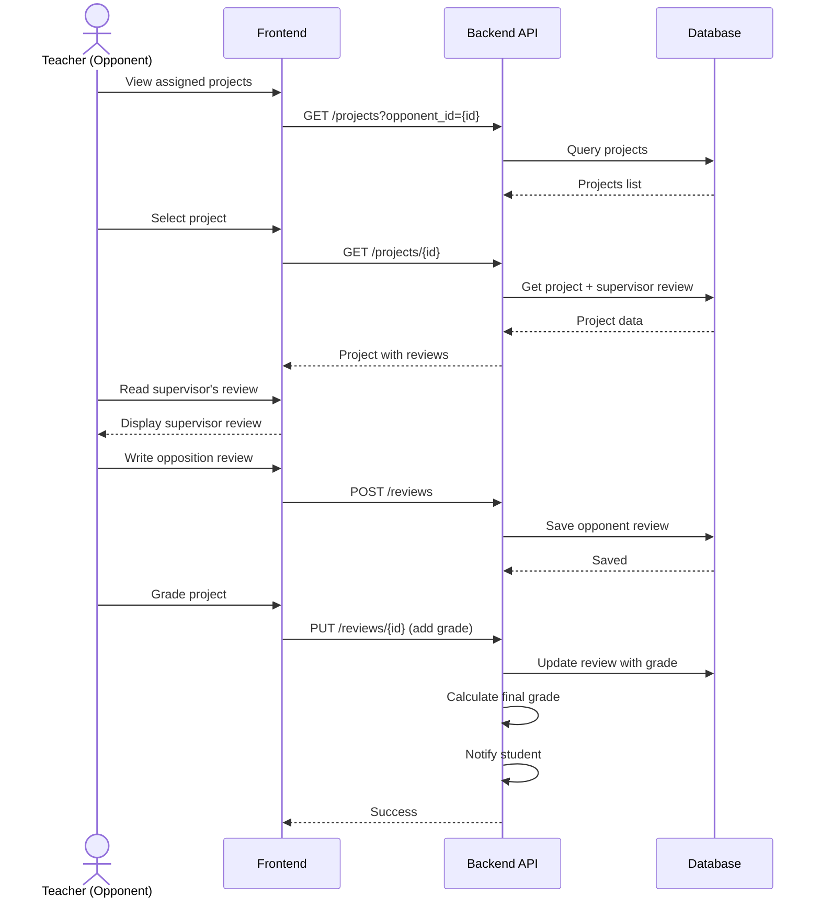

### 4.4 Administrator: Publish Project

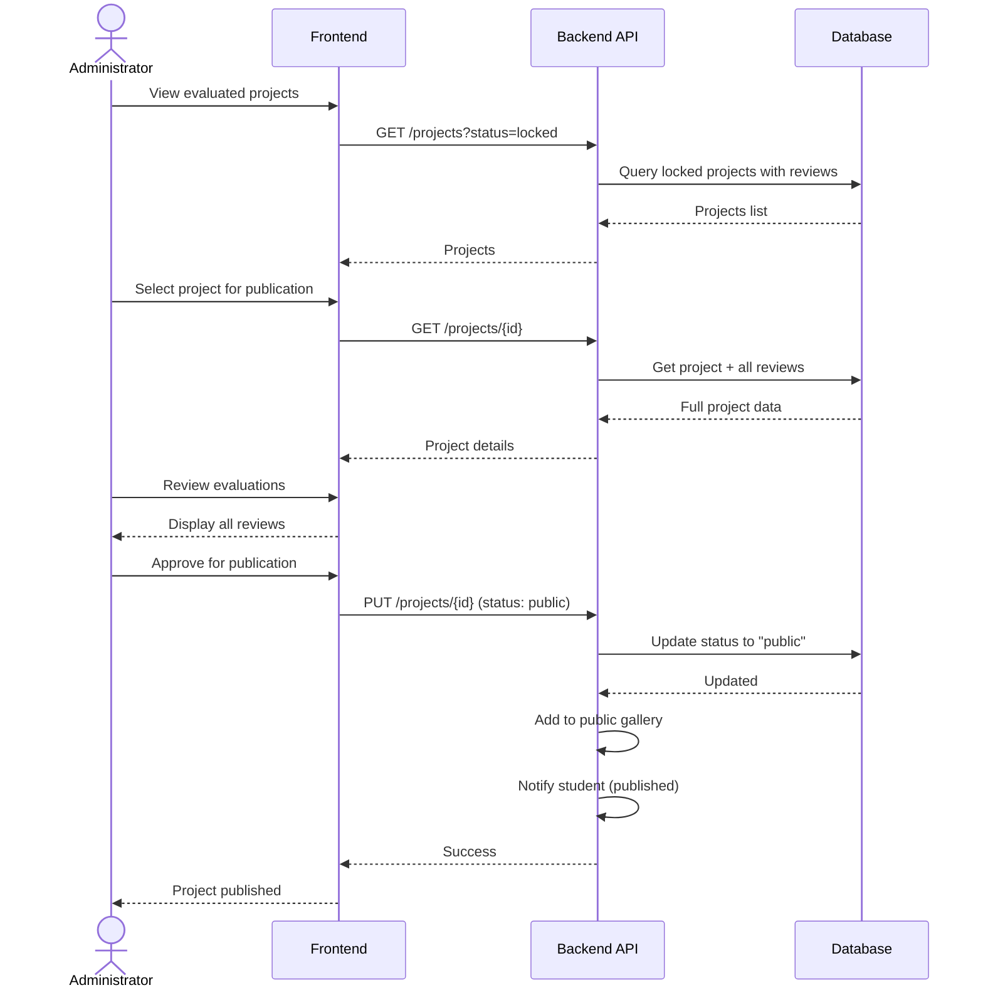

---

## 5. Activity Diagram

### Project Lifecycle

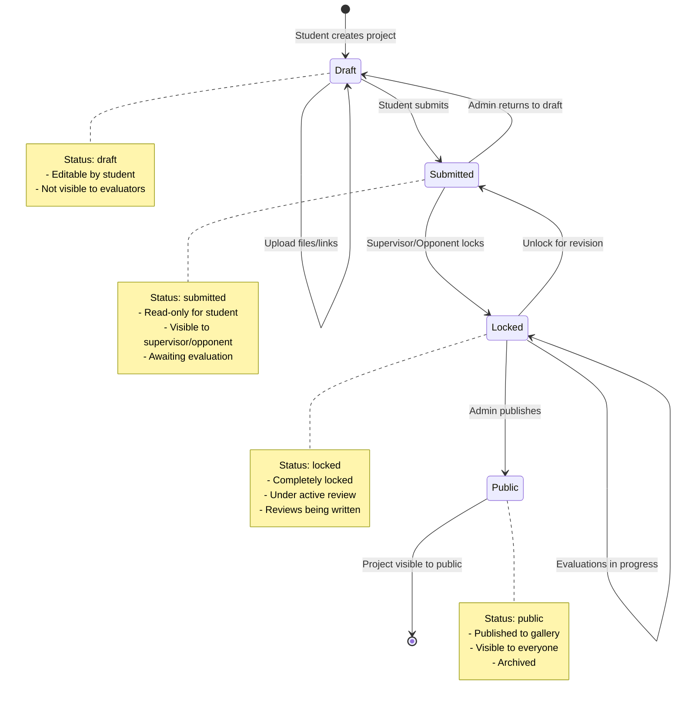

### Evaluation Workflow Activity Diagram

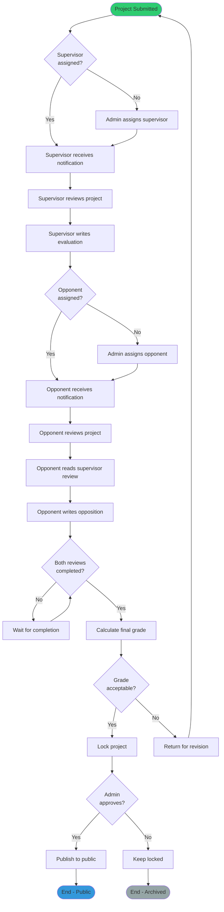

---

## 6. ER Diagram

### Database Entity Relationships

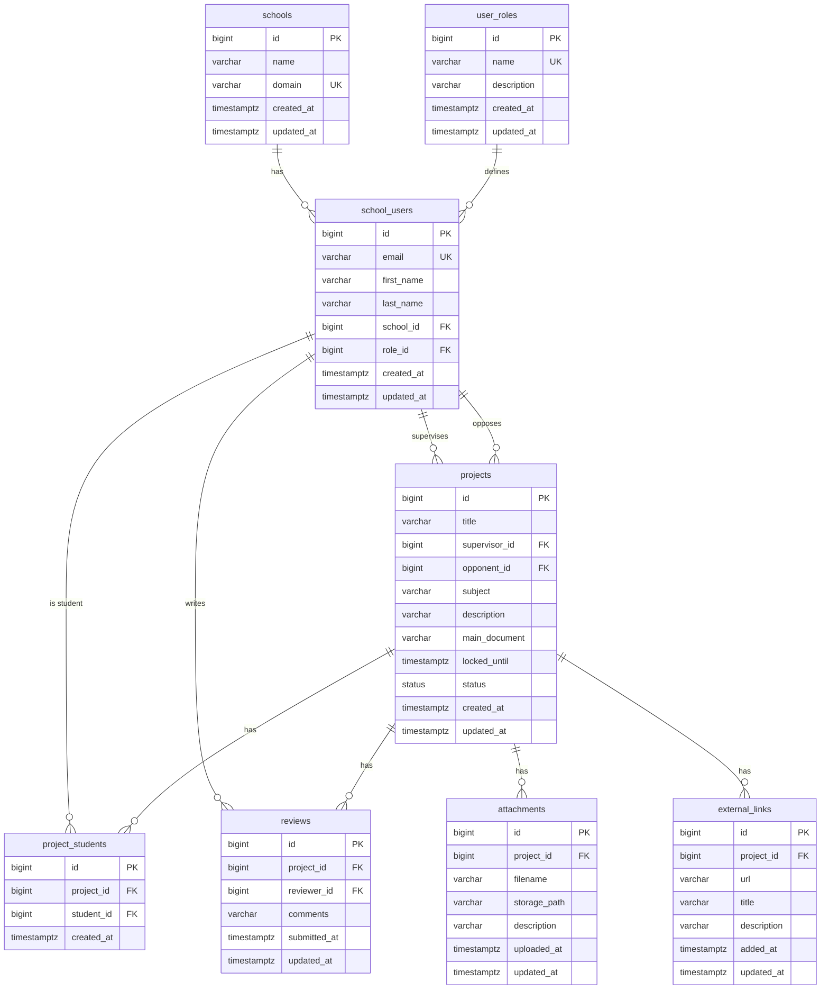

---

## Summary

### Role Permissions Matrix

| Action | Student | Teacher (Supervisor) | Teacher (Opponent) | Administrator |
|--------|---------|---------------------|-------------------|--------------|
| Create project | ✅ | ❌ | ❌ | ✅ |
| Edit draft project | ✅ (own) | ❌ | ❌ | ✅ |
| Submit project | ✅ (own) | ❌ | ❌ | ✅ |
| View project | ✅ (own/public) | ✅ (assigned) | ✅ (assigned) | ✅ (all) |
| Lock project | ❌ | ✅ (assigned) | ✅ (assigned) | ✅ |
| Write review | ❌ | ✅ (as supervisor) | ✅ (as opponent) | ❌ |
| Publish project | ❌ | ❌ | ❌ | ✅ |
| Manage users | ❌ | ❌ | ❌ | ✅ |
| View public projects | ✅ | ✅ | ✅ | ✅ |
| Upload attachments | ✅ (own) | ❌ | ❌ | ✅ |
| Export reviews | ❌ | ✅ (own) | ✅ (own) | ✅ |

### Status Transitions

```
draft → submitted → locked → public
  ↑         ↑         ↑
  └─────────┴─────────┘
     (can be reverted by admin)
```

---

*Generated for SumbiTheses - Systém pro odevzdávání a hodnocení maturitních projektů*
