# UML Diagrams - SumbiTheses System

System for submitting, evaluating, and publishing thesis projects (maturitní projekty).

---

## Table of Contents

1. [User Role Hierarchy](#1-user-role-hierarchy)
2. [Use Case Diagrams](#2-use-case-diagrams)
3. [Class Diagram](#3-class-diagram)
4. [Sequence Diagrams](#4-sequence-diagrams)
5. [State Diagram](#5-state-diagram)
6. [ER Diagram](#6-er-diagram)

---

## 1. User Role Hierarchy

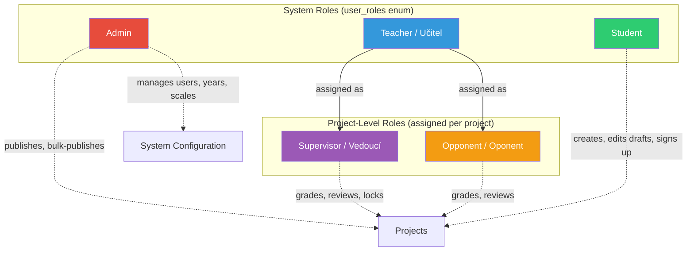
```mermaid
graph TB
    subgraph "System Roles (user_roles enum)"
        Admin[Admin]
        Teacher[Teacher / Učitel]
        Student[Student]
    end

    subgraph "Project-Level Roles (assigned per project)"
        Teacher --> |assigned as| Supervisor[Supervisor / Vedoucí]
        Teacher --> |assigned as| Opponent[Opponent / Oponent]
    end

    Admin -.-> |manages users, years, scales| SystemConfig[System Configuration]
    Admin -.-> |publishes, bulk-publishes| Projects[Projects]
    Supervisor -.-> |grades, reviews, locks| Projects
    Opponent -.-> |grades, reviews| Projects
    Student -.-> |creates, edits drafts, signs up| Projects

    style Admin fill:#e74c3c,color:#fff
    style Teacher fill:#3498db,color:#fff
    style Student fill:#2ecc71,color:#fff
    style Supervisor fill:#9b59b6,color:#fff
    style Opponent fill:#f39c12,color:#fff
```

### Auth Providers

| Provider | Description |
|----------|-------------|
| `local` | Email + bcrypt password |
| `microsoft` | Microsoft OAuth (Azure AD / Entra ID) with PKCE |
| `both` | Linked local + Microsoft accounts |

### Role Permissions Summary

| Action | Student | Teacher (Supervisor) | Teacher (Opponent) | Admin |
|--------|---------|---------------------|-------------------|-------|
| Create draft project | own only | ✅ | — | ✅ |
| Edit project | own draft only | supervised (draft/locked) | — | any |
| Delete project | — | supervised drafts only | — | any |
| Lock / Unlock project | — | supervised | — | ✅ |
| Publish project | — | — | — | ✅ |
| Bulk publish | — | — | — | ✅ |
| Submit grades | — | own grades (blind) | own grades (blind) | view all |
| Write review (posudek) | — | ✅ | ✅ | — |
| Sign up for project | ✅ | — | — | — |
| View signups | — | supervised | — | ✅ |
| Manage users | — | — | — | ✅ |
| Manage scales / years / subjects | — | — | — | ✅ |
| Upload attachments | own project | — | — | ✅ |
| View public projects | ✅ | ✅ | ✅ | ✅ |
| View notifications | own | own | own | own |

---

## 2. Use Case Diagrams

### 2.1 Complete System Use Case Diagram


```mermaid
graph TB
    Guest((Guest /<br/>Public))
    Student((Student))
    Teacher((Teacher))
    Admin((Admin))
    System((System /<br/>Scheduler))

    subgraph "Authentication"
        UC_LOGIN[Login - Local]
        UC_MS_LOGIN[Login - Microsoft OAuth]
        UC_REGISTER[Register]
        UC_SETUP_PW[Setup Password via Invitation]
        UC_SET_PW[Set Password for MS-only User]
        UC_LINK_MS[Link Microsoft Account]
    end

    subgraph "Public Access"
        UC_VIEW_PUBLIC[View Public Projects]
        UC_DOWNLOAD_ATTACHMENT[Download Public Attachments]
    end

    subgraph "Project Management"
        UC_CREATE_PROJECT[Create Project]
        UC_EDIT_PROJECT[Edit Draft Project]
        UC_DELETE_PROJECT[Delete Project]
        UC_UPLOAD_ATTACHMENTS[Upload Attachments]
        UC_MANAGE_LINKS[Manage External Links]
        UC_SIGNUP[Sign Up for Project]
        UC_CANCEL_SIGNUP[Cancel Signup]
        UC_VIEW_SIGNUPS[View Project Signups]
        UC_ASSIGN_STUDENT[Assign Student to Project]
    end

    subgraph "Evaluation & Grading"
        UC_LOCK[Lock Project]
        UC_UNLOCK[Unlock Project]
        UC_PUBLISH[Publish Project]
        UC_BULK_PUBLISH[Bulk Publish Projects]
        UC_SUBMIT_GRADES[Submit Grades]
        UC_VIEW_GRADES[View Grades]
        UC_WRITE_REVIEW[Write Review / Posudek]
    end

    subgraph "Administration"
        UC_MANAGE_USERS[Manage Users - CRUD]
        UC_INVITE_USER[Invite User via Email]
        UC_RESET_PW[Admin Reset Password]
        UC_CHANGE_ROLE[Change User Role]
        UC_BULK_YEAR[Bulk Assign Year to Users]
        UC_MANAGE_SCALES[Manage Scales & Scale Sets]
        UC_MANAGE_SUBJECTS[Manage Subjects]
        UC_MANAGE_YEARS[Manage Academic Years]
    end

    subgraph "Automated"
        UC_AUTO_LOCK[Auto-Lock Expired Projects]
        UC_DEADLINE_REMINDER[Send Deadline Reminders]
        UC_NOTIFICATIONS[Create Notifications]
    end

    %% Guest connections
    Guest --> UC_LOGIN
    Guest --> UC_MS_LOGIN
    Guest --> UC_REGISTER
    Guest --> UC_SETUP_PW
    Guest --> UC_VIEW_PUBLIC
    Guest --> UC_DOWNLOAD_ATTACHMENT

    %% Student connections
    Student --> UC_CREATE_PROJECT
    Student --> UC_EDIT_PROJECT
    Student --> UC_UPLOAD_ATTACHMENTS
    Student --> UC_MANAGE_LINKS
    Student --> UC_SIGNUP
    Student --> UC_CANCEL_SIGNUP
    Student --> UC_VIEW_GRADES
    Student --> UC_SET_PW
    Student --> UC_LINK_MS

    %% Teacher connections
    Teacher --> UC_LOCK
    Teacher --> UC_UNLOCK
    Teacher --> UC_SUBMIT_GRADES
    Teacher --> UC_WRITE_REVIEW
    Teacher --> UC_VIEW_SIGNUPS
    Teacher --> UC_ASSIGN_STUDENT
    Teacher --> UC_CREATE_PROJECT
    Teacher --> UC_EDIT_PROJECT
    Teacher --> UC_DELETE_PROJECT

    %% Admin connections
    Admin --> UC_PUBLISH
    Admin --> UC_BULK_PUBLISH
    Admin --> UC_MANAGE_USERS
    Admin --> UC_INVITE_USER
    Admin --> UC_RESET_PW
    Admin --> UC_CHANGE_ROLE
    Admin --> UC_BULK_YEAR
    Admin --> UC_MANAGE_SCALES
    Admin --> UC_MANAGE_SUBJECTS
    Admin --> UC_MANAGE_YEARS
    Admin --> UC_DELETE_PROJECT

    %% System connections
    System --> UC_AUTO_LOCK
    System --> UC_DEADLINE_REMINDER
    System --> UC_NOTIFICATIONS

    style Guest fill:#95a5a6,color:#fff
    style Student fill:#2ecc71,color:#fff
    style Teacher fill:#3498db,color:#fff
    style Admin fill:#e74c3c,color:#fff
    style System fill:#7f8c8d,color:#fff
```

### 2.2 Student Use Cases

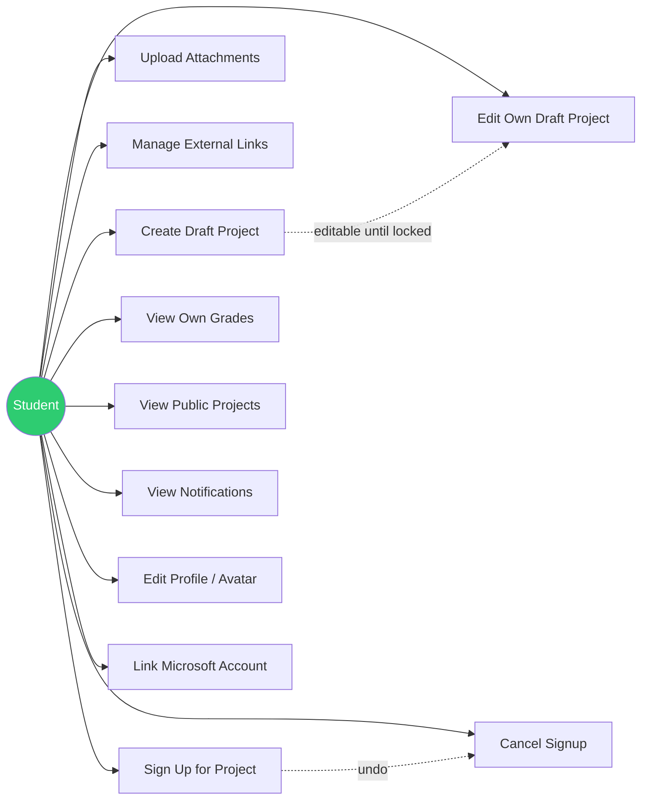
```mermaid
graph LR
    Student((Student))

    Student --> UC1[Create Draft Project]
    Student --> UC2[Edit Own Draft Project]
    Student --> UC3[Upload Attachments]
    Student --> UC4[Manage External Links]
    Student --> UC5[Sign Up for Project]
    Student --> UC6[Cancel Signup]
    Student --> UC7[View Own Grades]
    Student --> UC8[View Public Projects]
    Student --> UC9[View Notifications]
    Student --> UC10[Edit Profile / Avatar]
    Student --> UC11[Link Microsoft Account]

    UC1 -.-> |"editable until locked"| UC2
    UC5 -.-> |"undo"| UC6

    style Student fill:#2ecc71,color:#fff
```

### 2.3 Teacher Use Cases (Supervisor + Opponent)

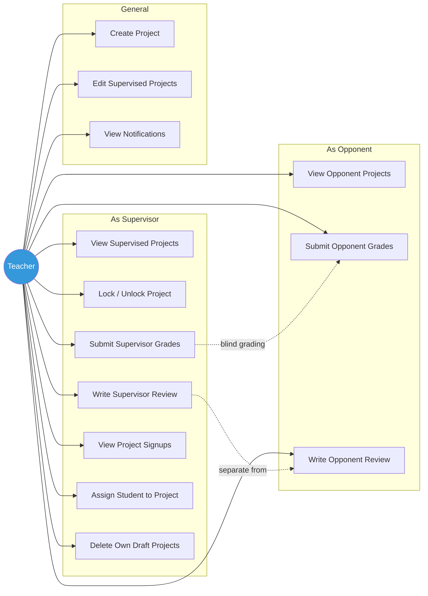
```mermaid
graph LR
    Teacher((Teacher))

    subgraph "As Supervisor"
        UC1[View Supervised Projects]
        UC2[Lock / Unlock Project]
        UC3[Submit Supervisor Grades]
        UC4[Write Supervisor Review]
        UC5[View Project Signups]
        UC6[Assign Student to Project]
        UC7[Delete Own Draft Projects]
    end

    subgraph "As Opponent"
        UC8[View Opponent Projects]
        UC9[Submit Opponent Grades]
        UC10[Write Opponent Review]
    end

    subgraph "General"
        UC11[Create Project]
        UC12[Edit Supervised Projects]
        UC13[View Notifications]
    end

    Teacher --> UC1
    Teacher --> UC2
    Teacher --> UC3
    Teacher --> UC4
    Teacher --> UC5
    Teacher --> UC6
    Teacher --> UC7
    Teacher --> UC8
    Teacher --> UC9
    Teacher --> UC10
    Teacher --> UC11
    Teacher --> UC12
    Teacher --> UC13

    UC3 -.-> |"blind grading"| UC9
    UC4 -.-> |"separate from"| UC10

    style Teacher fill:#3498db,color:#fff
```

### 2.4 Administrator Use Cases

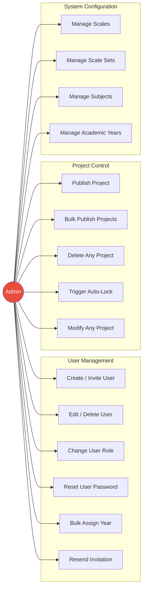
```mermaid
graph LR
    Admin((Admin))

    subgraph "User Management"
        UC1[Create / Invite User]
        UC2[Edit / Delete User]
        UC3[Change User Role]
        UC4[Reset User Password]
        UC5[Bulk Assign Year]
        UC6[Resend Invitation]
    end

    subgraph "Project Control"
        UC7[Publish Project]
        UC8[Bulk Publish Projects]
        UC9[Delete Any Project]
        UC10[Trigger Auto-Lock]
        UC11[Modify Any Project]
    end

    subgraph "System Configuration"
        UC12[Manage Scales]
        UC13[Manage Scale Sets]
        UC14[Manage Subjects]
        UC15[Manage Academic Years]
    end

    Admin --> UC1
    Admin --> UC2
    Admin --> UC3
    Admin --> UC4
    Admin --> UC5
    Admin --> UC6
    Admin --> UC7
    Admin --> UC8
    Admin --> UC9
    Admin --> UC10
    Admin --> UC11
    Admin --> UC12
    Admin --> UC13
    Admin --> UC14
    Admin --> UC15

    style Admin fill:#e74c3c,color:#fff
```

---

## 3. Class Diagram

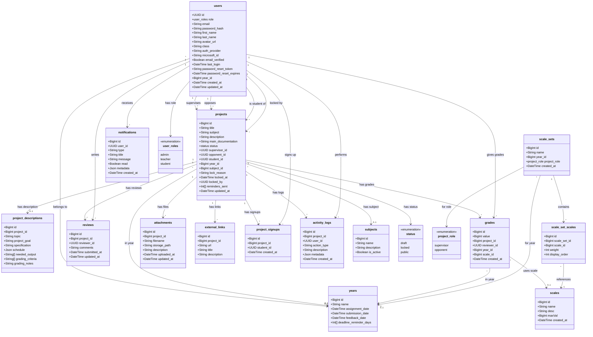
```mermaid
classDiagram
    class users {
        +UUID id
        +user_roles role
        +String email
        +String password_hash
        +String first_name
        +String last_name
        +String avatar_url
        +String class
        +String auth_provider
        +String microsoft_id
        +Boolean email_verified
        +DateTime last_login
        +String password_reset_token
        +DateTime password_reset_expires
        +BigInt year_id
        +DateTime created_at
        +DateTime updated_at
    }

    class projects {
        +BigInt id
        +String title
        +String subject
        +String description
        +String main_documentation
        +status status
        +UUID supervisor_id
        +UUID opponent_id
        +UUID student_id
        +BigInt year_id
        +BigInt subject_id
        +String lock_reason
        +DateTime locked_at
        +UUID locked_by
        +Int[] reminders_sent
        +DateTime updated_at
    }

    class project_descriptions {
        +BigInt id
        +BigInt project_id
        +String topic
        +String project_goal
        +String specification
        +Json schedule
        +String[] needed_output
        +String[] grading_criteria
        +String grading_notes
    }

    class grades {
        +BigInt id
        +BigInt value
        +BigInt project_id
        +UUID reviewer_id
        +BigInt year_id
        +BigInt scale_id
        +DateTime created_at
    }

    class reviews {
        +BigInt id
        +BigInt project_id
        +UUID reviewer_id
        +String comments
        +DateTime submitted_at
        +DateTime updated_at
    }

    class scales {
        +BigInt id
        +String name
        +String desc
        +BigInt maxVal
        +DateTime created_at
    }

    class scale_sets {
        +BigInt id
        +String name
        +BigInt year_id
        +project_role project_role
        +DateTime created_at
    }

    class scale_set_scales {
        +BigInt id
        +BigInt scale_set_id
        +BigInt scale_id
        +Int weight
        +Int display_order
    }

    class attachments {
        +BigInt id
        +BigInt project_id
        +String filename
        +String storage_path
        +String description
        +DateTime uploaded_at
        +DateTime updated_at
    }

    class external_links {
        +BigInt id
        +BigInt project_id
        +String url
        +String title
        +String description
    }

    class project_signups {
        +BigInt id
        +BigInt project_id
        +UUID student_id
        +DateTime created_at
    }

    class activity_logs {
        +BigInt id
        +BigInt project_id
        +UUID user_id
        +String action_type
        +String description
        +Json metadata
        +DateTime created_at
    }

    class notifications {
        +BigInt id
        +UUID user_id
        +String type
        +String title
        +String message
        +Boolean read
        +Json metadata
        +DateTime created_at
    }

    class years {
        +BigInt id
        +String name
        +DateTime assignment_date
        +DateTime submission_date
        +DateTime feedback_date
        +Int[] deadline_reminder_days
    }

    class subjects {
        +BigInt id
        +String name
        +String description
        +Boolean is_active
    }

    class user_roles {
        <<enumeration>>
        admin
        teacher
        student
    }

    class status {
        <<enumeration>>
        draft
        locked
        public
    }

    class project_role {
        <<enumeration>>
        supervisor
        opponent
    }

    %% User relationships
    users --> user_roles : has role
    users "1" --> "*" projects : supervises
    users "1" --> "*" projects : opposes
    users "1" --> "*" projects : is student of
    users "1" --> "*" projects : locked by
    users "*" --> "0..1" years : belongs to

    %% Project relationships
    projects --> status : has status
    projects "1" --> "0..1" project_descriptions : has description
    projects "1" --> "*" grades : has grades
    projects "1" --> "*" reviews : has reviews
    projects "1" --> "*" attachments : has files
    projects "1" --> "*" external_links : has links
    projects "1" --> "*" project_signups : has signups
    projects "1" --> "*" activity_logs : has logs
    projects "*" --> "0..1" years : in year
    projects "*" --> "0..1" subjects : has subject

    %% Grading relationships
    users "1" --> "*" grades : gives grades
    grades "*" --> "0..1" scales : uses scale
    grades "*" --> "1" years : in year
    scale_sets --> project_role : for role
    scale_sets "*" --> "0..1" years : for year
    scale_sets "1" --> "*" scale_set_scales : contains
    scale_set_scales "*" --> "1" scales : references

    %% Other relationships
    users "1" --> "*" reviews : writes
    users "1" --> "*" project_signups : signs up
    users "1" --> "*" activity_logs : performs
    users "1" --> "*" notifications : receives
```

---

## 4. Sequence Diagrams

### 4.1 Authentication: Local Login

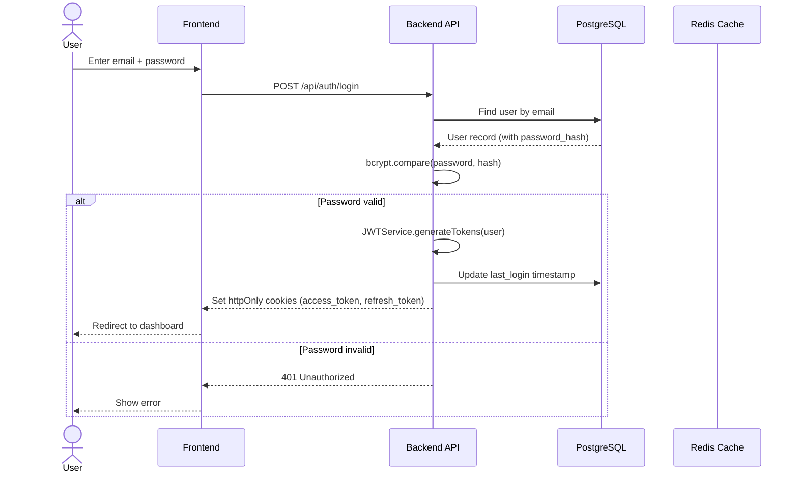
```mermaid
sequenceDiagram
    actor User
    participant UI as Frontend
    participant API as Backend API
    participant DB as PostgreSQL
    participant Redis as Redis Cache

    User->>UI: Enter email + password
    UI->>API: POST /api/auth/login
    API->>DB: Find user by email
    DB-->>API: User record (with password_hash)
    API->>API: bcrypt.compare(password, hash)
    alt Password valid
        API->>API: JWTService.generateTokens(user)
        API->>DB: Update last_login timestamp
        API-->>UI: Set httpOnly cookies (access_token, refresh_token)
        UI-->>User: Redirect to dashboard
    else Password invalid
        API-->>UI: 401 Unauthorized
        UI-->>User: Show error
    end
```

### 4.2 Authentication: Microsoft OAuth (PKCE)

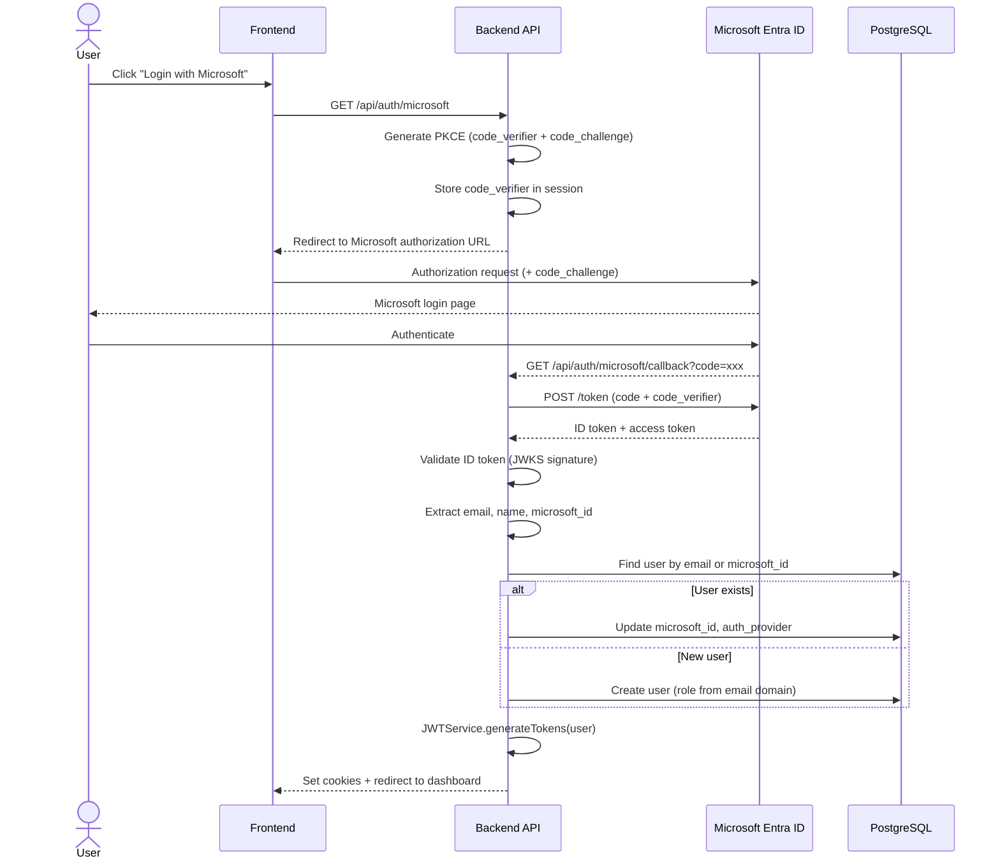
```mermaid
sequenceDiagram
    actor User
    participant UI as Frontend
    participant API as Backend API
    participant MS as Microsoft Entra ID
    participant DB as PostgreSQL

    User->>UI: Click "Login with Microsoft"
    UI->>API: GET /api/auth/microsoft
    API->>API: Generate PKCE (code_verifier + code_challenge)
    API->>API: Store code_verifier in session
    API-->>UI: Redirect to Microsoft authorization URL

    UI->>MS: Authorization request (+ code_challenge)
    MS-->>User: Microsoft login page
    User->>MS: Authenticate
    MS-->>API: GET /api/auth/microsoft/callback?code=xxx

    API->>MS: POST /token (code + code_verifier)
    MS-->>API: ID token + access token
    API->>API: Validate ID token (JWKS signature)
    API->>API: Extract email, name, microsoft_id

    API->>DB: Find user by email or microsoft_id
    alt User exists
        API->>DB: Update microsoft_id, auth_provider
    else New user
        API->>DB: Create user (role from email domain)
    end

    API->>API: JWTService.generateTokens(user)
    API-->>UI: Set cookies + redirect to dashboard
```

### 4.3 Project Creation & Submission Flow

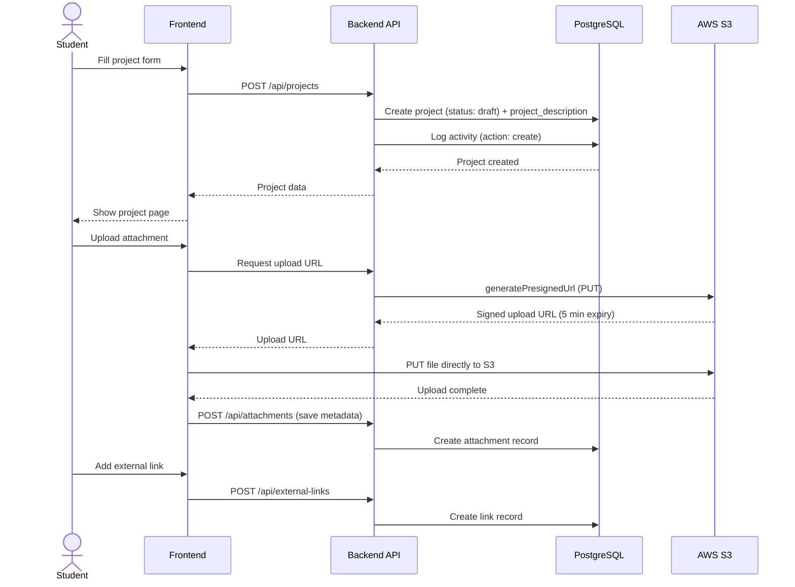
```mermaid
sequenceDiagram
    actor Student
    participant UI as Frontend
    participant API as Backend API
    participant DB as PostgreSQL
    participant S3 as AWS S3

    Student->>UI: Fill project form
    UI->>API: POST /api/projects
    API->>DB: Create project (status: draft) + project_description
    API->>DB: Log activity (action: create)
    DB-->>API: Project created
    API-->>UI: Project data
    UI-->>Student: Show project page

    Student->>UI: Upload attachment
    UI->>API: Request upload URL
    API->>S3: generatePresignedUrl (PUT)
    S3-->>API: Signed upload URL (5 min expiry)
    API-->>UI: Upload URL
    UI->>S3: PUT file directly to S3
    S3-->>UI: Upload complete
    UI->>API: POST /api/attachments (save metadata)
    API->>DB: Create attachment record

    Student->>UI: Add external link
    UI->>API: POST /api/external-links
    API->>DB: Create link record
```

### 4.4 Grading Flow (Blind Grading)

```mermaid
sequenceDiagram
    actor Supervisor
    actor Opponent
    participant UI as Frontend
    participant API as Backend API
    participant DB as PostgreSQL

    Note over Supervisor,DB: Supervisor grades first (blind - cannot see opponent's grades)

    Supervisor->>UI: Open project grading tab
    UI->>API: GET /api/projects/:id/grading/scale-set
    API->>DB: Find scale_set for year + role=supervisor
    DB-->>API: Scale set with scales + weights
    API-->>UI: Scales to grade on

    Supervisor->>UI: Enter grades + write posudek
    UI->>API: POST /api/projects/:id/grading/submit
    API->>DB: Upsert grades per scale + save review
    API->>DB: Log activity (grade_submit)
    API->>DB: Create notification for student
    API-->>UI: Grades saved

    Note over Opponent,DB: Opponent grades independently (blind grading)

    Opponent->>UI: Open project grading tab
    UI->>API: GET /api/projects/:id/grading/scale-set
    API->>DB: Find scale_set for year + role=opponent
    DB-->>API: Scale set (may differ from supervisor's)
    API-->>UI: Scales to grade on

    Opponent->>UI: Enter grades + write posudek
    UI->>API: POST /api/projects/:id/grading/submit
    API->>DB: Upsert grades per scale + save review
    API-->>UI: Grades saved

    Note over Supervisor,DB: Admin can view all grades; teachers see only their own
```

### 4.5 Admin: Publish Project

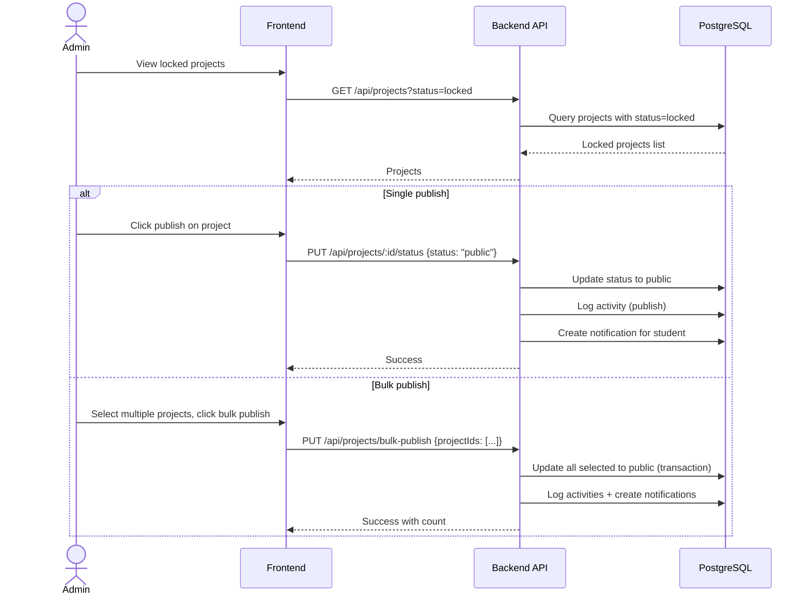
```mermaid
sequenceDiagram
    actor Admin
    participant UI as Frontend
    participant API as Backend API
    participant DB as PostgreSQL

    Admin->>UI: View locked projects
    UI->>API: GET /api/projects?status=locked
    API->>DB: Query projects with status=locked
    DB-->>API: Locked projects list
    API-->>UI: Projects

    alt Single publish
        Admin->>UI: Click publish on project
        UI->>API: PUT /api/projects/:id/status {status: "public"}
        API->>DB: Update status to public
        API->>DB: Log activity (publish)
        API->>DB: Create notification for student
        API-->>UI: Success
    else Bulk publish
        Admin->>UI: Select multiple projects, click bulk publish
        UI->>API: PUT /api/projects/bulk-publish {projectIds: [...]}
        API->>DB: Update all selected to public (transaction)
        API->>DB: Log activities + create notifications
        API-->>UI: Success with count
    end
```

### 4.6 User Invitation Flow

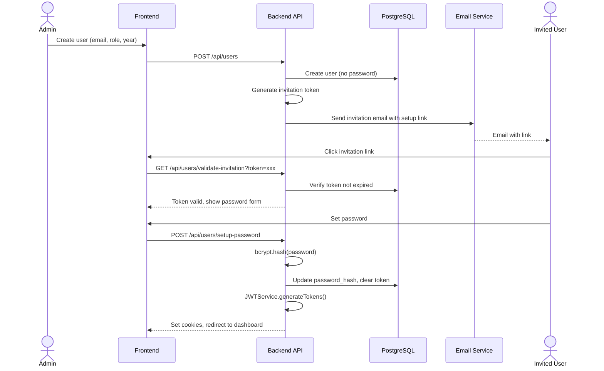
```mermaid
sequenceDiagram
    actor Admin
    participant UI as Frontend
    participant API as Backend API
    participant DB as PostgreSQL
    participant Email as Email Service
    actor NewUser as Invited User

    Admin->>UI: Create user (email, role, year)
    UI->>API: POST /api/users
    API->>DB: Create user (no password)
    API->>API: Generate invitation token
    API->>Email: Send invitation email with setup link
    Email-->>NewUser: Email with link

    NewUser->>UI: Click invitation link
    UI->>API: GET /api/users/validate-invitation?token=xxx
    API->>DB: Verify token not expired
    API-->>UI: Token valid, show password form

    NewUser->>UI: Set password
    UI->>API: POST /api/users/setup-password
    API->>API: bcrypt.hash(password)
    API->>DB: Update password_hash, clear token
    API->>API: JWTService.generateTokens()
    API-->>UI: Set cookies, redirect to dashboard
```

---

## 5. State Diagram

### Project Lifecycle

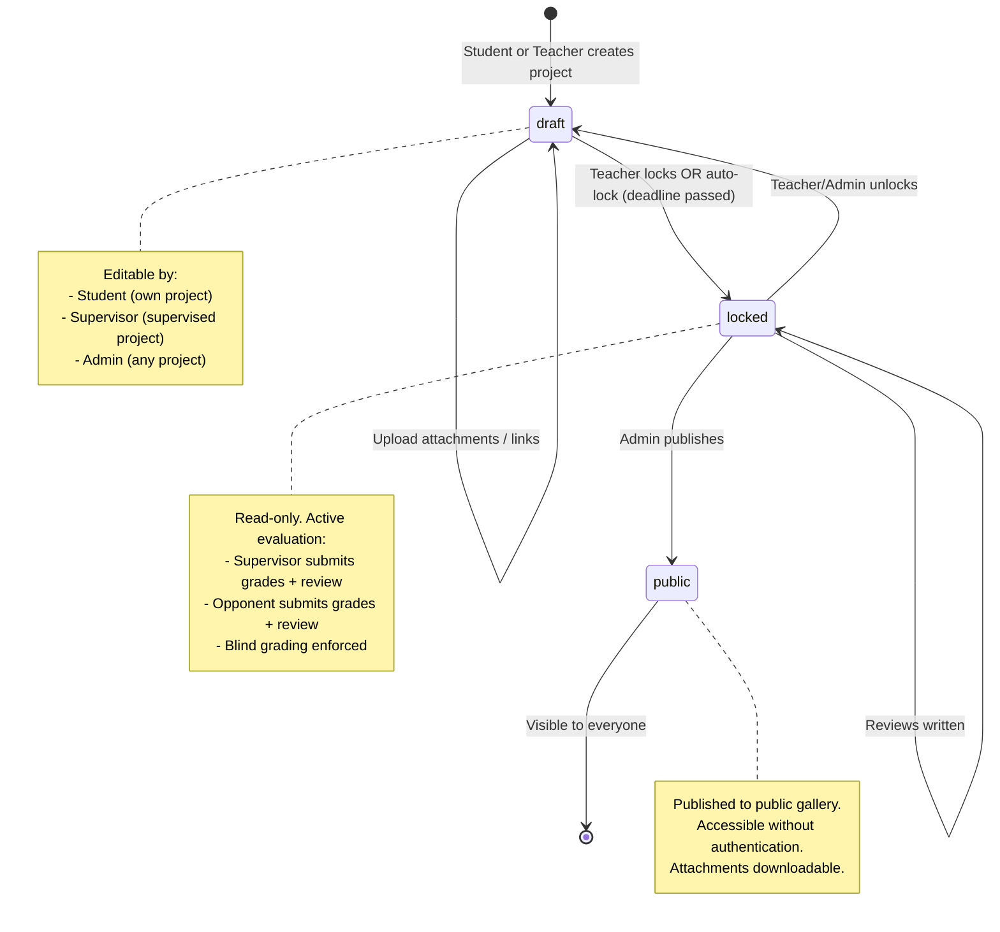
```mermaid
stateDiagram-v2
    [*] --> draft: Student or Teacher creates project

    draft --> draft: Student edits (own)
    draft --> draft: Teacher edits (supervised)
    draft --> draft: Upload attachments / links
    draft --> locked: Teacher locks OR auto-lock (deadline passed)

    locked --> draft: Teacher/Admin unlocks
    locked --> locked: Grades submitted
    locked --> locked: Reviews written
    locked --> public: Admin publishes

    public --> [*]: Visible to everyone

    note right of draft
        Editable by:
        - Student (own project)
        - Supervisor (supervised project)
        - Admin (any project)
    end note

    note right of locked
        Read-only. Active evaluation:
        - Supervisor submits grades + review
        - Opponent submits grades + review
        - Blind grading enforced
    end note

    note right of public
        Published to public gallery.
        Accessible without authentication.
        Attachments downloadable.
    end note
```

### Status Transitions Summary

```
draft ──[lock]──► locked ──[publish]──► public
  ▲                  │
  └──[unlock]────────┘
```

- **draft → locked**: Teacher locks project, OR system auto-locks past deadline
- **locked → draft**: Teacher/Admin unlocks for revision
- **locked → public**: Admin publishes (single or bulk)

---

## 6. ER Diagram

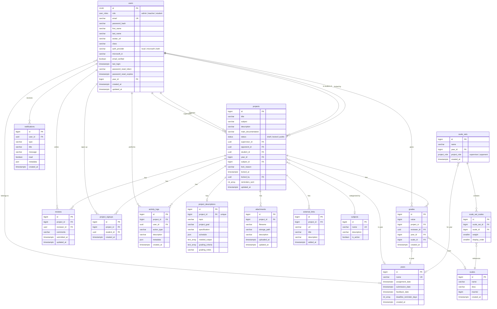
```mermaid
erDiagram
    users ||--o{ projects : "supervises"
    users ||--o{ projects : "opposes"
    users ||--o{ projects : "is student of"
    users ||--o{ projects : "locked by"
    users ||--o{ grades : "gives"
    users ||--o{ reviews : "writes"
    users ||--o{ project_signups : "signs up"
    users ||--o{ activity_logs : "performs"
    users ||--o{ notifications : "receives"
    users }o--o| years : "belongs to"

    projects ||--o| project_descriptions : "has"
    projects ||--o{ grades : "has"
    projects ||--o{ reviews : "has"
    projects ||--o{ attachments : "has"
    projects ||--o{ external_links : "has"
    projects ||--o{ project_signups : "has"
    projects ||--o{ activity_logs : "has"
    projects }o--o| years : "in year"
    projects }o--o| subjects : "categorized by"

    grades }o--o| scales : "uses"
    grades }o--|| years : "in year"

    scale_sets ||--o{ scale_set_scales : "contains"
    scale_set_scales }o--|| scales : "references"
    scale_sets }o--o| years : "for year"

    users {
        UUID id PK
        user_roles role "admin | teacher | student"
        varchar email UK
        varchar password_hash
        varchar first_name
        varchar last_name
        varchar avatar_url
        varchar class
        varchar auth_provider "local | microsoft | both"
        varchar microsoft_id
        boolean email_verified
        timestamptz last_login
        varchar password_reset_token
        timestamptz password_reset_expires
        bigint year_id FK
        timestamptz created_at
        timestamptz updated_at
    }

    projects {
        bigint id PK
        varchar title
        varchar subject
        varchar description
        varchar main_documentation
        status status "draft | locked | public"
        uuid supervisor_id FK
        uuid opponent_id FK
        uuid student_id FK
        bigint year_id FK
        bigint subject_id FK
        varchar lock_reason
        timestamptz locked_at
        uuid locked_by FK
        int_array reminders_sent
        timestamptz updated_at
    }

    project_descriptions {
        bigint id PK
        bigint project_id FK "unique"
        varchar topic
        varchar project_goal
        varchar specification
        json schedule
        text_array needed_output
        text_array grading_criteria
        varchar grading_notes
    }

    grades {
        bigint id PK
        bigint value
        bigint project_id FK
        uuid reviewer_id FK
        bigint year_id FK
        bigint scale_id FK
        timestamptz created_at
    }

    reviews {
        bigint id PK
        bigint project_id FK
        uuid reviewer_id FK
        varchar comments
        timestamptz submitted_at
        timestamptz updated_at
    }

    scales {
        bigint id PK
        varchar name
        varchar desc
        bigint maxVal
        timestamptz created_at
    }

    scale_sets {
        bigint id PK
        varchar name
        bigint year_id FK
        project_role project_role "supervisor | opponent"
        timestamptz created_at
    }

    scale_set_scales {
        bigint id PK
        bigint scale_set_id FK
        bigint scale_id FK
        smallint weight
        smallint display_order
    }

    attachments {
        bigint id PK
        bigint project_id FK
        varchar filename
        varchar storage_path
        varchar description
        timestamptz uploaded_at
        timestamptz updated_at
    }

    external_links {
        bigint id PK
        bigint project_id FK
        varchar url
        varchar title
        varchar description
        timestamptz added_at
    }

    project_signups {
        bigint id PK
        bigint project_id FK
        uuid student_id FK
        timestamptz created_at
    }

    activity_logs {
        bigint id PK
        bigint project_id FK
        uuid user_id FK
        varchar action_type
        varchar description
        json metadata
        timestamptz created_at
    }

    notifications {
        bigint id PK
        uuid user_id FK
        varchar type
        varchar title
        varchar message
        boolean read
        json metadata
        timestamptz created_at
    }

    years {
        bigint id PK
        varchar name UK
        timestamptz assignment_date
        timestamptz submission_date
        timestamptz feedback_date
        int_array deadline_reminder_days
        timestamptz created_at
    }

    subjects {
        bigint id PK
        varchar name UK
        varchar description
        boolean is_active
    }
```

---

*Generated for SumbiTheses - Systém pro odevzdávání a hodnocení maturitních projektů*
